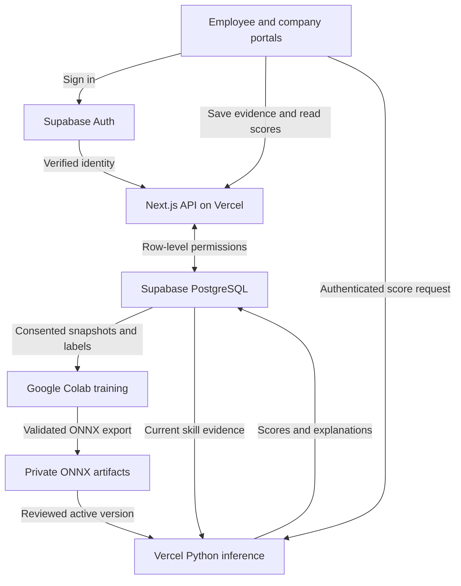

# Skill Passport — complete connection map

The implementation is prepared in the existing project. **The Supabase schema upgrade is live; the redesigned website is not deployed yet.** The exact approved migration was applied as `20261007180805` and its live RLS/grants were verified. Vercel denies access to the existing team. No real model is active, and the server-only Supabase credential is not configured in this workspace. The notebook is ready to run; it has not been executed in your Google Colab account.

## The system at a glance

The private artifacts are stored in the Supabase `models` bucket. The worker uses `model_registry` to find the active, reviewed version. Colab is used for training; the website does not depend on a notebook being continuously online.

## Exact platform targets

| Item | Target |
|---|---|
| Vercel team | `syntax-873d` |
| Existing Vercel project | `prj_oeQs4MdpFrxE2DzNdYEN4TMtNHwM` |
| Canonical website | `https://skill-passport-syntax-873d.vercel.app` |
| Supabase project | `cctxrjmchntgbslnnhxp` |
| Supabase API | `https://cctxrjmchntgbslnnhxp.supabase.co` |
| Model bucket | `models`, private |
| Registry model name | `skill_passport_readiness_v2` |
| Feature contract | `skill-passport-v2.1` |
| Notebook | `ml/Skill_Passport_Training.ipynb` |

No replacement Vercel or Supabase project is required.

## Frontend → backend → database

| User action | Route / module | Database connection |
|---|---|---|
| Sign in | `/login`, `/auth/callback` | Supabase Auth creates/refreshes the session. |
| Create employee profile | `POST /api/portal`, action `profile` | Own row in `skill_passports`. |
| Record skill evidence | `POST /api/portal`, action `log` | Own `skill_logs` row; self-reported by default. |
| Record task/capacity | `POST /api/portal`, action `task` | Own private `project_tasks` row. |
| Share or revoke | `POST /api/portal`, action `share` / `unshare` | `passport_shares`, controlled by the employee. |
| Create company | `POST /api/portal`, action `company` | `companies`, owner tied to the verified account. |
| Publish/remove role | `POST /api/portal`, action `role` / `delete_role` | Own company's `company_roles`. |
| Pair mentor and junior | `POST /api/portal`, action `assignment` | `peer_assignments`; both people must share with that company. |
| View workspace | `GET /api/portal?mode=employee` or `company` | Permitted records only; scores come from `user_skill_analytics`. |
| Refresh scores | `POST /api/inference`, bearer session token | ONNX scoring, then `store_skill_analytics` transaction. |
| Inspect setup | Authenticated `GET /api/health` | Checks new schema access, active-model registration and server credential presence; not proof of a successful Python invocation. |

Both frontend and backend use the same Supabase project. Normal API requests use the signed-in person's session, so row-level security remains in force. Only the Python training/inference operations use the privileged server key.

## Training → model storage → inference

| Stage | File | Output / requirement |
|---|---|---|
| Read evidence | `ml/data_loader.py` | Paginated skill logs, tasks and peer assignments from Supabase. |
| Build features | `ml/feature_engineering.py` | Recency-adjusted technical score, communication evidence, job-task fit and other bounded skill features. |
| Capture a historical snapshot | `ml/prepare_training_data.py capture` | Private, timestamped features for consenting employees. |
| Add a later independent assessment | `ml/prepare_training_data.py attach` | `training_examples`; no fabricated labels. |
| Optimize/train/explain | `ml/train_and_explain.py` | Grouped holdout, Optuna XGBoost, SHAP, model card, ONNX parity test. |
| Upload real artifacts | `upload_bundle` in training module | Versioned files in private Storage; inactive `model_registry` row. |
| Review and activate | Explicit database-owner operation | Exactly one active real model for the registry name. |
| Run production score | `api/inference.py` + `ml/pipeline_runner.py` | Verified user, bounded request rate, checksummed model, exact per-input Shapley explanation. |
| Save atomically | `store_skill_analytics` | Public-to-authorized-parties metrics and separate employee-only workload signals. |

The six trained inputs are technical index, communication score, task-fit score, experience years, verified-skill count and recorded skill-growth velocity. Private workload, personality and turnover are not model inputs.

## Credentials: put each value in the right place

| Value | Browser | Vercel environment | Colab Secrets |
|---|---|---|---|
| Supabase project URL | `NEXT_PUBLIC_SUPABASE_URL` | Same public value plus `SUPABASE_URL` for Python | `SUPABASE_URL` |
| Publishable key | `NEXT_PUBLIC_SUPABASE_PUBLISHABLE_KEY` | Public setting | Not used for privileged training |
| Server-only key | Never | `SUPABASE_SERVICE_KEY` | `SUPABASE_SERVICE_KEY` |
| Canonical website URL | Public | `NEXT_PUBLIC_SITE_URL` | Not required |
| Google OAuth client secret | Never | Not required by app | Not required; configure in Supabase Google provider |

Do not paste secret values into chat. Add them directly in the corresponding project's environment/Secrets settings. Installing ChatGPT connectors does not automatically copy credentials into a website or notebook.

## Google sign-in redirects

1. Website → Supabase Auth → Google account selection.
2. Google returns to `https://cctxrjmchntgbslnnhxp.supabase.co/auth/v1/callback`.
3. Supabase returns to `https://skill-passport-syntax-873d.vercel.app/auth/callback`.
4. The application receives the session and opens the workspace.

Use the first callback in the Google OAuth client configuration and the second in Supabase's redirect allowlist. Share the canonical public website, not a protected Vercel preview. Google OAuth setup and Colab training are separate integrations.

## Deployment gates, in order

1. **Database upgrade — complete.** Explicit approval was received and `supabase/migrations/20261007180805_employee_company_ml.sql` was applied successfully. Do not apply it again to this project.
2. **Vercel access.** The installed connection returns HTTP 403 for the existing project and reports no accessible teams. Connect an account/integration with access to `syntax-873d`; do not create a new project as a workaround. The local CLI is not authenticated either.
3. **Server/Colab secret setup.** Put the privileged Supabase key in the Vercel server environment and Colab Secrets. It is not present in this workspace. Avoid public variable prefixes for this key.
4. **Schema and UI release.** The migration and permission inspection are complete. Build/deploy the same Vercel project, then test with separate employee/company accounts.
5. **Real training.** Collect consented evidence and later independently assessed labels. The three existing ML tables currently have zero rows and there is no active real model. Synthetic demo output cannot be activated by this pipeline.
6. **Model release.** Run the notebook, review results, upload the real bundle inactive, activate its exact version, then invoke the authenticated scoring endpoint and verify the persisted result.
7. **End-to-end proof.** Employee saves evidence → company cannot see it until sharing → score appears with model version and explanation → private workload remains hidden → revocation removes the company's access.

Database approval, account access, credential setup and real labels are distinct requirements. Approving one does not supply the others.

## Release status recorded during this request

| Connection | Evidence | State |
|---|---|---|
| Supabase management access | Read-only preflight succeeded | Connected |
| New Supabase schema | Migration 20261007180805 applied; live RLS/grants checked | Installed |
| Vercel management access | Project request 403; accessible teams empty | Blocked |
| Colab source | Runnable notebook and ML ZIP saved | Prepared, not executed in user's account |
| Google sign-in | Supabase Auth reports Google enabled | Provider enabled; callback test pending |
| Real model | `model_registry` count 0 | Not trained or active |
| Frontend/backend implementation | Local build, browser, Python and SQL checks passed | Prepared, not newly deployed |

Existing Supabase advisory notes also report RLS-without-policies on the four imported market-data tables and the two service-only training/throttling tables (they remain inaccessible to normal browser roles, which is intentional here), and leaked-password protection is disabled. See [Supabase RLS advisory documentation](https://supabase.com/docs/guides/database/database-linter?lint=0008_rls_enabled_no_policy) and [password protection documentation](https://supabase.com/docs/guides/auth/password-security#password-strength-and-leaked-password-protection). No security settings were changed during these checks.
